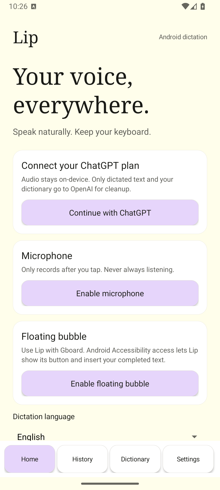
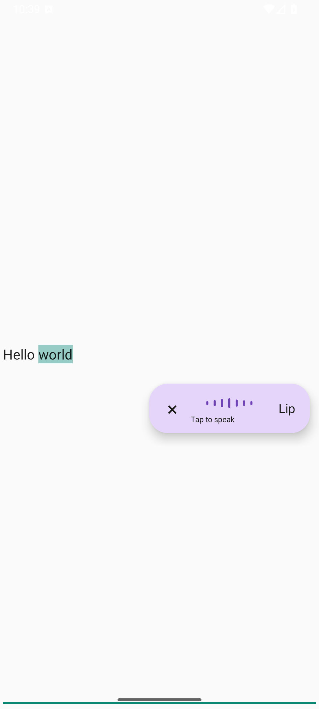
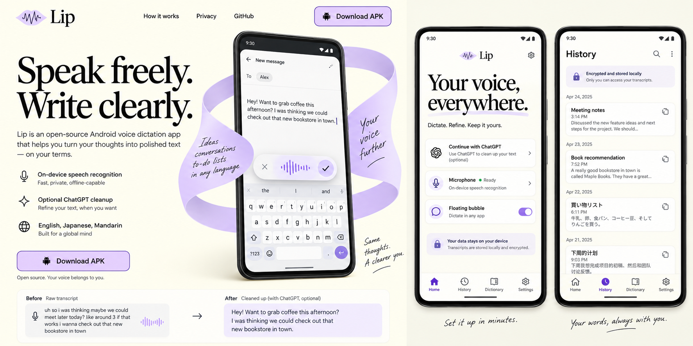

# Lip

Open-source Android voice dictation with a floating bubble alongside your existing keyboard. Speech recognition runs on-device; ChatGPT-plan text cleanup is optional.

[Website](https://ihearttokyo.github.io/Lip/) · [Download v0.2.0 APK](https://github.com/ihearttokyo/Lip/releases/download/v0.2.0/Lip-0.2.0.apk) · [Privacy](https://ihearttokyo.github.io/Lip/privacy.html) · [Issues](https://github.com/ihearttokyo/Lip/issues)

**v0.2.0 is a parity-work prerelease, not verified functional parity.** Real-device segmented speech, compatibility across third-party editors, and end-to-end ChatGPT authorization still require a phone. See the [acceptance matrix](docs/PARITY.md). This is not a feature-parity claim, a Play Store-reviewed app, or a replacement for Gboard.

## What it does

| Capability | v0.2.0 scope |
| --- | --- |
| Floating dictation | Android 13+ accessibility overlay; user-triggered capture and current-editor insertion while Gboard remains selected |
| Local speech | Continuous local PCM into an explicit on-device segmented recognizer; English, Japanese, or Mandarin requires an installed model and compatible provider |
| Optional cleanup | Official ChatGPT OAuth and public Responses API; eligible account, preview access, and usage limits apply |
| Live preview | Local hypotheses appear while speaking; opt-in ChatGPT cleanup revises stable segments without inserting provisional text |
| Writing controls | Polished, Light, and Verbatim styles; spoken punctuation/lists/corrections instructions; dictionary biasing; optional review-before-insert |
| Local history | Independent encrypted raw/clean records; paged search, copy, delete, clear, and disable future retention |
| Insertion safeguards | Reject protected fields and stale editor/focus/selection/content state; never send a message |
| Not included | Cloud audio, a swipe/replacement keyboard, cross-device sync, always-listening capture, or autonomous UI navigation |

The website's illustrated phone screens and before/after text are labeled illustrations, not screenshots or live recognition results.

## Installation

1. Use Android 13 (API 33) or newer with a compatible on-device speech-recognition service. Obtain `Lip-0.2.0.apk` from the [v0.2.0 release](https://github.com/ihearttokyo/Lip/releases/tag/v0.2.0). Check the release's SHA-256 and signing-certificate information before installing.
2. Android may request permission for the browser/file manager to install an APK. Allow it only if you trust this source; turn off that install permission afterward. Do not disable Play Protect.
3. Open Lip. Read the microphone disclosure and grant microphone permission. Read the separate accessibility disclosure, then enable Lip in Android accessibility settings. Sideloaded apps may require an additional system-controlled restricted-settings confirmation; proceed only after verifying the app and source.
4. Select English, Japanese, or Mandarin and check model availability. Missing local speech support is an error, not a cloud fallback. Device model availability and recognition quality vary.
5. Keep Gboard selected. Focus a supported text editor, tap Lip's bubble, speak, and stop. By default, successful cleaned or Verbatim text is inserted only into the unchanged original target. After switching apps, review the retained text and tap **Insert here** in the intended field; no silent rebinding occurs. Enable review-before-insert in Settings to approve each result. Use the in-app test composer if the overlay/editor path is unsupported.
6. History is enabled by default. Disable saving new history, delete individual entries, or clear existing history from Lip. Disabling retention does not erase earlier entries.

History no longer has a whole-collection 4 MiB ceiling. Each encrypted record retains a safety size limit; device storage still limits capacity. Existing v0.1 history migrates only after verified copies. The old APK cannot read the new record format: do not uninstall or clear app data to downgrade. Reinstalling this version without clearing data preserves access. Review remains inside the nonfocusable bubble.

Continuous capture depends on provider support for Android's external-audio segmented mode. Lip refuses providers that end early or ignore this mode rather than silently dropping speech between restarts. A session ends on Finish/Cancel, permission loss, service loss, locking or protected-field focus. A visible 32,768-character safety boundary applies; there is no one-minute timer.

Accessibility is a powerful permission. Lip's scope is dictation into a selected editor, not screen scraping for cloud context, autonomous actions, or message sending. Password/protected fields are excluded. Disable Lip in Android accessibility settings to remove the bubble and insertion access.

## ChatGPT cleanup (optional)

Choose **Continue with ChatGPT** in Lip. The system browser handles OpenAI sign-in and user authorization; no API key or shared client secret is needed. Lip follows the official open-source dynamic registration flow, retains the issued client ID for that installation/account, and uses PKCE plus a `127.0.0.1` loopback callback. Return to Lip after browser authorization.

Only the transcript, cleanup instructions, and applicable dictionary terms are sent to OpenAI. New sign-in explicitly discloses live cleanup. When enabled, stable segments may be sent before Finish; Settings can disable Live ChatGPT preview independently. Upgrading does not opt existing installations into live requests. Cancel prevents queued requests and stale results, but cannot recall requests already sent. Preview and final cleanup use plan allowance. Surrounding editor content stays local. Requests use `store:false` and `stream:true`; a partial/failed stream is not a usable cleaned result. These settings do not promise zero provider retention. OpenAI's terms and privacy policies govern its processing.

Preview eligibility, account/workspace restrictions, models, and usage limits can change. This route does not grant audio-transcription access or general API credits. If sign-in, cleanup, or allowance checks fail, local dictation and the raw transcript remain available. Sign out clears local OAuth tokens and attempts provider-side revocation; account/client-registration metadata is retained for reconnection. If revocation fails, use your account controls to revoke authorization.

Sources: [registration/sign-in](https://developers.openai.com/siwc/token-sharing-open-source/sign-in), [models/inference](https://developers.openai.com/siwc/token-sharing-open-source/models-and-inference), [preview limits](https://developers.openai.com/siwc/token-sharing-open-source/preview-limitations).

## Build and checks

Pinned toolchain: JDK 17, Android SDK 36, Build Tools 36.0.0, Android Gradle plugin 8.13.2, Gradle 8.13, Kotlin 2.3.10. The wrapper handles Gradle; install a managed JDK and the Android SDK separately. Set `ANDROID_HOME` or your uncommitted `local.properties` SDK path.

```sh
./gradlew testDebugUnitTest lintDebug assembleDebug
node docs/app.js --self-test
```

The debug APK is generated at `app/build/outputs/apk/debug/app-debug.apk`. It uses a debug signing key and is distinct from the published signed prerelease APK. Production signing keys must stay outside Git. Toolchain references: [AGP](https://developer.android.com/build/releases/agp-8-13-0-release-notes), [Kotlin](https://kotlinlang.org/docs/gradle-configure-project.html).

To sign a release, set `LIP_SIGNING_PROPERTIES` to an untracked properties file containing `storeFile`, `storePassword`, `keyAlias`, and `keyPassword`, then run `./gradlew assembleRelease`. Without that file, the release build is unsigned and must not be distributed as an installable APK. Never upload signing keys or passwords to this repository.

To inspect the static site locally:

```sh
python3 -m http.server 8080 --directory docs
```

Open `http://localhost:8080/`. The page needs no build step, framework, remote fonts, account, or microphone. Its prepared examples and native HTML controls work without a backend. Clipboard access is user-triggered and falls back to selected text when unavailable.

## Architecture and privacy

```text
AccessibilityService → visible dictation bubble
                       ↓
             local AudioRecord → on-device segmented SpeechRecognizer
                       ↓
             local transcript / optional ChatGPT text cleanup
                       ↓
            unchanged-editor guard → AccessibilityInputConnection
                       ↓
            encrypted local raw/clean history (if enabled)
```

The system-bound accessibility service uses API 33's input-method connection, not destructive full-field `SET_TEXT`. It keeps the existing keyboard selected and captures only after a user action. The awake, system-bound accessibility process supplies cross-app microphone capability; Lip adds no microphone foreground service, ordinary overlay permission, or replacement IME. OEM microphone behavior remains a hardware-validation gate.

Android Keystore-backed AES-GCM protects retained credentials and transcript history in app-private storage excluded from backup. Copying text places it on the system clipboard outside that encrypted store. No audio files, analytics, advertising SDK, cloud history, or transcript logging are included. [Privacy policy source](docs/privacy.html) · [implementation and evidence contract](docs/IMPLEMENTATION.md).

### Failure behavior and known limits

- **No local recognizer/model:** choose an installed language or obtain the model through your device's supported settings. Lip does not fall back to remote recognition.
- **Permission denied or microphone unavailable:** grant permission intentionally, leave calls/competing capture, and retry manually. Do not assume a visible bubble overrides Android's microphone rules.
- **Cleanup fails or allowance is exhausted:** retain/use the local transcript; reconnect or retry later rather than losing the spoken text.
- **Editor or cursor changes:** automatic insertion is blocked; review and explicitly choose Insert here at the intended field before any commit attempt. An unconfirmed dispatched commit is never retried automatically. No automatic focus restoration or simulated taps.
- **Custom/protected editor:** support varies. Test the in-app composer and use manual copy/paste if needed; do not bypass the editor's restrictions.
- **History/key loss:** uninstalling or losing the Keystore key can make retained data unrecoverable. No export/recovery or sync is provided in this release.

### Validation boundary

Unit/build/lint evidence belongs in the release notes. Static tests do not prove microphone, OAuth, or third-party editor compatibility on a phone. Device testing should cover native/Compose/browser editors, selection replacement, existing keyboard composition, focus changes during cleanup, missing language models, offline use, permission denial, and protected-field refusal. Do not use sensitive transcripts in public bug reports.

## Visual reference

### Actual emulator screen

These v0.1 visual-baseline images show Lip running on the isolated Android 16/API 36 emulator. They show the home screen, not microphone quality or authenticated ChatGPT access.



The floating bubble below is also an actual emulator capture, over a synthetic editor. Native cross-app selection replacement and stale-target refusal pass the smoke check; microphone and ChatGPT account behavior still need a phone.



The retained design input below is AI-generated concept art, **not an Android screenshot or evidence of app behavior**. The static site uses original SVG/CSS illustrations derived from its direction.



## License and attribution

Lip source and original web artwork are [MIT licensed](LICENSE), copyright 2026 Jared Bland. Dependency and tool notices are in [NOTICE.md](NOTICE.md). Lip is not affiliated with or endorsed by Wispr, Google, or OpenAI. It contains no copied Wispr assets, code, logos, or testimonials.
